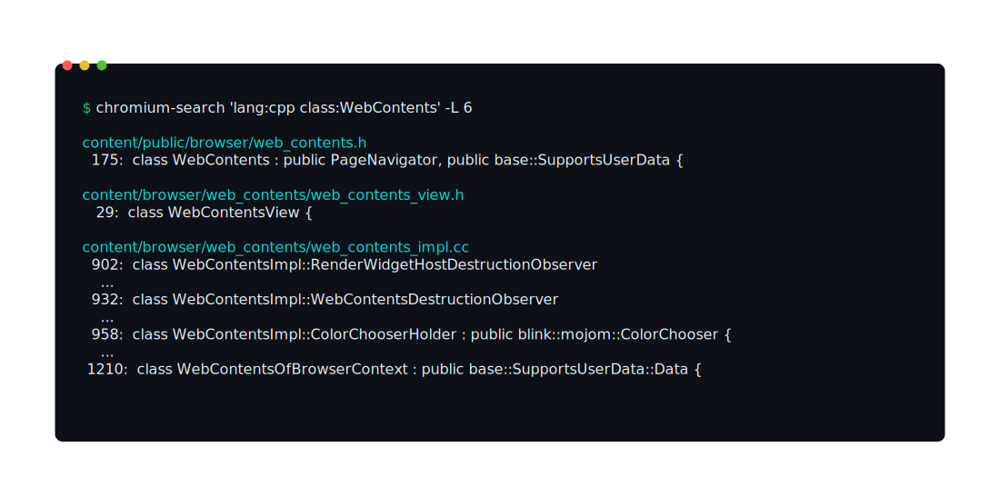

# chromium-search

An agent friendly CLI for [Chromium source code](https://source.chromium.org).

A single-file Python script with zero dependencies. Talks directly to the Chromium Code Search API.



## Install

The script is a single standalone script. Fetch it and customize it to fit your needs.

```
curl -o chromium-search https://raw.githubusercontent.com/jclay/chromium-search/main/chromium-search.py
chmod +x chromium-search
```

Put it somewhere on your `PATH`. Requires Python 3.11+ or [`uv`](https://docs.astral.sh/uv/).

## Usage

```
chromium-search <query>                   # search source code
chromium-search find <name>               # find files by name
chromium-search cat <path>                # print file contents
chromium-search syntax                    # query syntax reference
```

### Search

```
chromium-search base::span
chromium-search 'lang:cpp class:WebContents'
chromium-search 'usage:TabStripModel -file:out/' -C 3
chromium-search 'file:*_test.cc base::span' -L 10
chromium-search 'function:CreateForTesting lang:cpp' --json
```

`-L <n>` limits results (default 30). `-C <n>` adds context lines. `--json` outputs JSON.

Supports filters: `lang:`, `file:`, `class:`, `function:`, `symbol:`, `usage:`, `comment:`, `case:yes`, `pcre:`. Run `chromium-search syntax` for the full reference.

### Find

```
chromium-search find web_contents.h
```

Returns file paths matching the name (fuzzy, up to 10 results).

### Cat

```
chromium-search cat content/public/browser/web_contents.h
chromium-search cat base/containers/span.h -n
chromium-search cat chrome/browser/BUILD.gn --ref refs/tags/144.0.7559.98
```

`-n` adds line numbers. `--ref` fetches at a specific git ref or tag.

## How it works

Queries the Grimoire API that powers source.chromium.org. Search and find use the batch REST transport; cat uses gRPC-Web to the FileService. No authentication required.

## License

MIT
